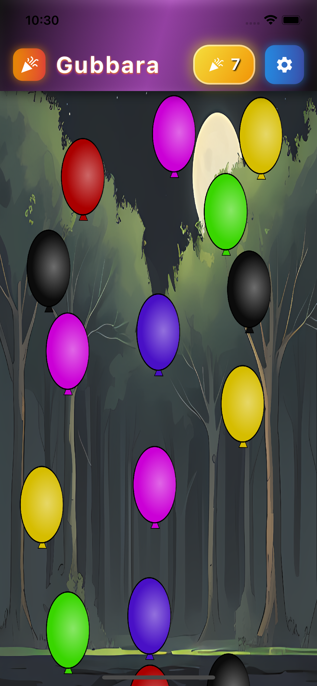

# Balloon Bounce Letters - Flutter Game

A fun educational game built with Flutter and Flame where players catch Nepali letters in a basket to spell words.



## Features

- **Physics-based gameplay**: Balloons float up with gravity and bounce off moving platforms
- **Nepali letter learning**: Catch the correct letters to spell words
- **Player controls**: Move the basket left/right using arrow keys or A/D keys
- **Sound effects**: Balloon burst sound when catching wrong letters
- **Burst animations**: Animated sprite sheet burst effect when catching wrong letters
- **Visual feedback**: Colorful balloons with Nepali character images

## Gameplay

1. Balloons with Nepali letters float up from the bottom
2. Use arrow keys (← →) or A/D keys to move the basket left/right
3. Catch the correct letters in order to spell the target word
4. If you catch a wrong letter, the balloon bursts with a sound and animated burst effect
5. Complete words to progress through the game

## Setup

1. Make sure you have Flutter installed
2. Install dependencies:
   ```bash
   flutter pub get
   ```
3. Run the game:
   ```bash
   flutter run
   ```

### Running in VS Code

The project includes VS Code launch configurations (`.vscode/launch.json`). You can:

1. Open the project in VS Code
2. Press `F5` or go to Run and Debug
3. Select one of the available configurations:
   - **gubbara (Flutter)** - Debug mode (default)
   - **gubbara (Flutter) - Profile** - Profile mode for performance testing
   - **gubbara (Flutter) - Release** - Release mode
   - **gubbara (Flutter) - iOS Simulator** - Run on iOS simulator
   - **gubbara (Flutter) - Android Emulator** - Run on Android emulator
   - **gubbara (Flutter) - Chrome** - Run in Chrome browser

## Controls

- **Left Arrow** or **A**: Move basket left
- **Right Arrow** or **D**: Move basket right

## Assets

The game follows Flame's recommended asset structure:

```
assets/
├── audio/
│   └── balloon-burst.mp3  # Sound effect for wrong letter catches
└── images/
    ├── char_1.png through char_36.png  # Nepali character images
    ├── red.png, blue.png, etc.  # Balloon sprite images in various colors
    └── *SpriteSheetAnimation.png  # Burst animation sprite sheets
```

All assets are automatically loaded when the game starts using `images.loadAllImages()`.

## Game Structure

- `lib/main.dart`: Entry point and UI overlay
- `lib/game/balloon_game.dart`: Main game class with physics and game logic
- `lib/game/components/`: Game components
  - `balloon.dart`: Balloon with Nepali letters
  - `basket.dart`: Player-controlled basket
  - `platform.dart`: Moving platforms for balloons to bounce off
  - `world_boundaries.dart`: Physics boundaries
  - `burst_animation.dart`: Sprite sheet animation for balloon bursts

## Technologies

- **Flutter**: UI framework
- **Flame**: Game engine
- **Flame Forge2D**: Physics engine
- **Flame Audio**: Sound effects

Enjoy the game!

